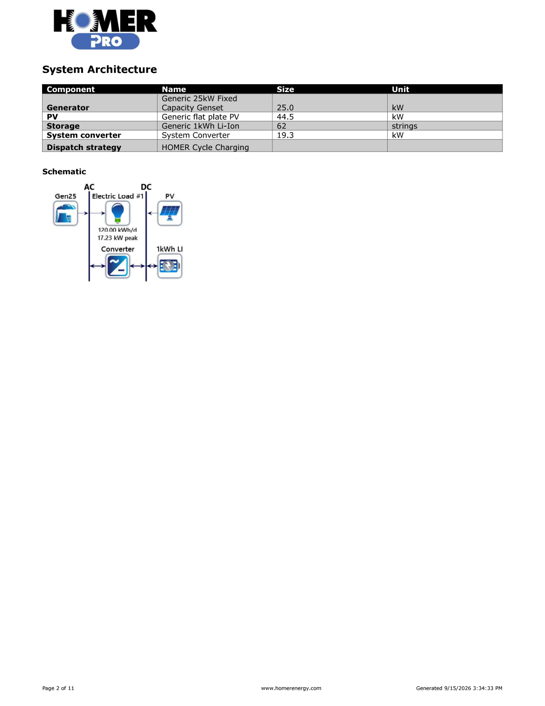
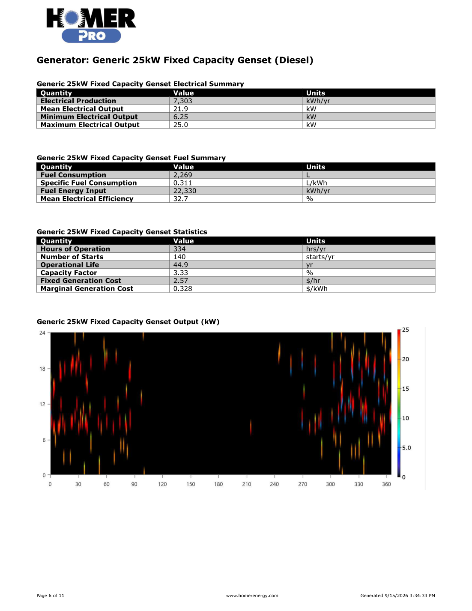
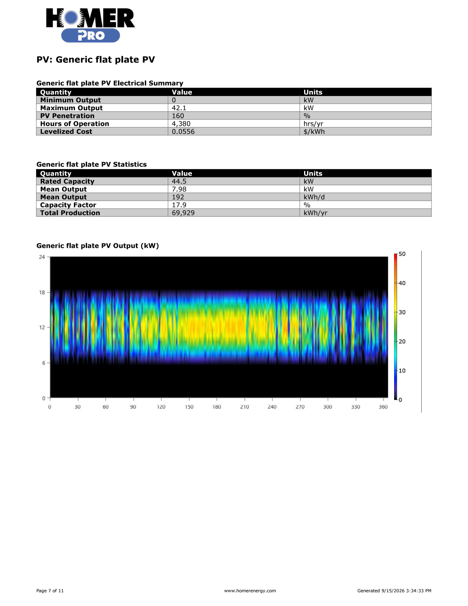
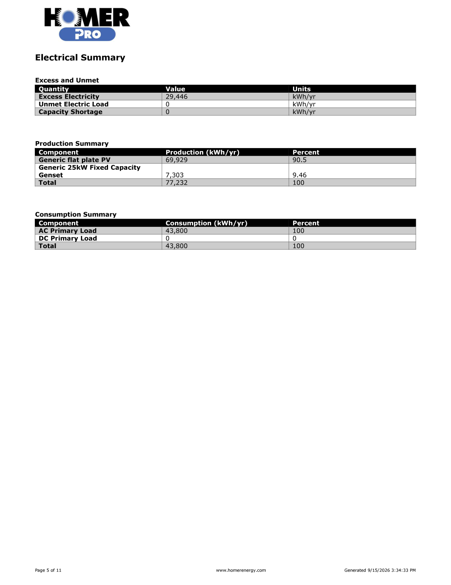
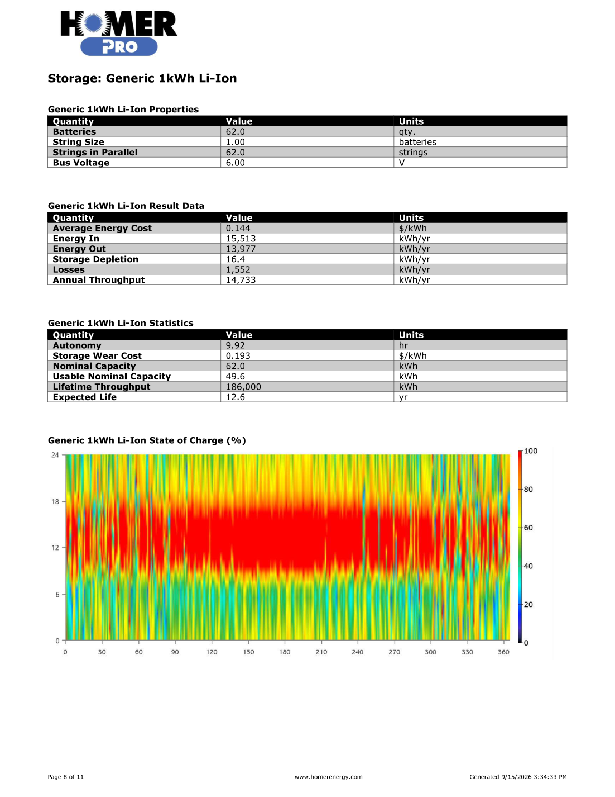
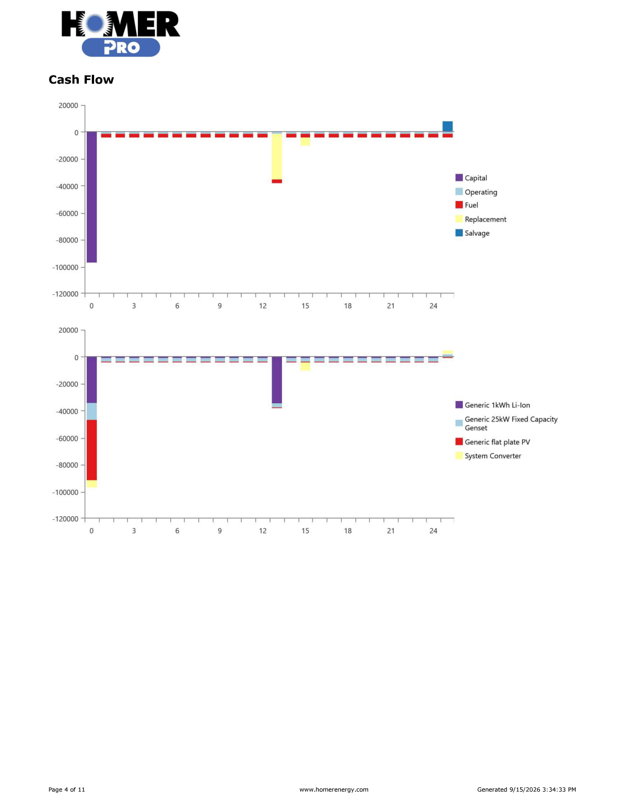

# HOMER Pro PV–Diesel–BESS Microgrid Optimization

## Overview

This project presents a **techno-economic optimization of an off-grid PV–diesel–battery microgrid** for a remote facility using **HOMER Pro**.

The study evaluates the optimal sizing and operation of:

- Solar photovoltaic (PV) generation
- Diesel generation
- Lithium-ion battery energy storage system (BESS)
- Bidirectional AC/DC converter
- Microgrid dispatch strategy

The system supplies an AC load of **120 kWh/day** (43,800 kWh/year), with zero annual capacity shortage allowed.

The project also includes a **two-variable sensitivity analysis** examining the effects of diesel fuel price and solar resource on optimal system sizing, renewable penetration, fuel consumption, net present cost (NPC), and cost of energy (COE).

> **Study note:** This is an engineering portfolio / training study. The solar resource and synthetic load profile are assumed inputs and should be replaced with validated site data for an investment-grade feasibility study.

---

## System Architecture

The optimized baseline system consists of:

| Component | Optimized Size |
|---|---:|
| Solar PV | **44.5 kW** |
| Diesel Generator | **25.0 kW** |
| Li-ion BESS | **62 kWh nominal** |
| Usable Battery Capacity | **49.6 kWh** |
| System Converter | **19.3 kW** |
| Dispatch Strategy | **HOMER Cycle Charging** |

**Baseline sensitivity case:**

- Diesel price: **$1.20/L**
- Solar GHI: **5.38 kWh/m²/day**
- Project lifetime: **25 years**
- Nominal discount rate: **8%**
- Inflation rate: **2%**
- Annual capacity shortage: **0%**



---

## Load Model

The modeled remote facility has:

| Parameter | Value |
|---|---:|
| Average daily consumption | 120 kWh/day |
| Annual consumption | 43,800 kWh/year |
| Average load | 5.0 kW |
| Peak load | approximately 17.23 kW |

A synthetic commercial load profile was used for this portfolio study.

---

## Solar PV System

The baseline HOMER optimum selects **44.5 kW of generic flat-plate PV**.

Key PV results:

| Metric | Result |
|---|---:|
| Rated capacity | 44.5 kW |
| Annual PV production | 69,929 kWh/year |
| Mean output | 7.98 kW |
| Maximum output | 42.1 kW |
| Capacity factor | 17.9% |
| PV penetration | 160% |
| PV levelized cost | $0.0556/kWh |



PV penetration greater than 100% does **not** mean that PV supplies the load continuously. Annual PV production exceeds annual load energy, but the timing of PV production and facility demand does not perfectly coincide.

---

## Battery Energy Storage System

The optimized system contains **62 generic 1-kWh lithium-ion battery units**.

| Metric | Result |
|---|---:|
| Nominal capacity | 62.0 kWh |
| Usable nominal capacity | 49.6 kWh |
| Autonomy | 9.92 h |
| Energy into storage | 15,513 kWh/year |
| Energy out of storage | 13,977 kWh/year |
| Annual throughput | 14,733 kWh/year |
| Storage losses | 1,552 kWh/year |
| Expected battery life | 12.6 years |



The BESS shifts energy between periods of PV surplus and periods of insufficient solar production while also interacting with the diesel generator under Cycle Charging dispatch.

---

## Diesel Generator

A **25 kW fixed-capacity diesel generator** provides firm backup generation.

| Metric | Result |
|---|---:|
| Annual generation | 7,303 kWh/year |
| Operating hours | 334 h/year |
| Number of starts | 140 starts/year |
| Mean output while operating | 21.9 kW |
| Capacity factor | 3.33% |
| Diesel consumption | 2,269 L/year |
| Specific fuel consumption | 0.311 L/kWh |
| Mean electrical efficiency | 32.7% |



The low annual operating hours demonstrate that the generator primarily serves as a backup and firming resource rather than the principal source of energy.

---

## Converter

The optimized bidirectional converter capacity is **19.3 kW**.

The converter enables:

- DC-to-AC conversion from PV/BESS to the AC load
- AC-to-DC conversion when generator power is used to charge the battery

| Metric | Inverter | Rectifier |
|---|---:|---:|
| Capacity | 19.3 kW | 19.3 kW |
| Mean output | 4.75 kW | 0.559 kW |
| Maximum output | 17.2 kW | 19.3 kW |
| Hours of operation | 8,455 h/year | 305 h/year |
| Energy out | 41,653 kWh/year | 4,898 kWh/year |



---

## Energy Balance

The optimized baseline system produces:

| Source | Production | Share |
|---|---:|---:|
| Solar PV | 69,929 kWh/year | 90.5% |
| Diesel Generator | 7,303 kWh/year | 9.46% |
| **Total** | **77,232 kWh/year** | **100%** |

The AC primary load consumes **43,800 kWh/year**.

Additional results:

| Metric | Result |
|---|---:|
| Renewable fraction | **83.3%** |
| Excess electricity | **29,446 kWh/year** |
| Unmet electric load | **0 kWh/year** |
| Capacity shortage | **0 kWh/year** |



### Engineering Observation: Excess Energy

The **29,446 kWh/year of excess electricity** is a significant result.

Although additional PV reduces diesel operation, a substantial portion of renewable production cannot be consumed or stored at the time it is available.

Possible future investigations include:

- Flexible/deferrable loads
- Water pumping
- Thermal storage
- EV charging
- Additional or alternative BESS sizing
- Hydrogen production
- Grid export where applicable

---

## Economic Results

For the baseline case:

| Economic KPI | Result |
|---|---:|
| Initial capital | **$96,877** |
| Total Net Present Cost (NPC) | **$166,159.40** |
| Levelized Cost of Energy (COE) | **$0.2935/kWh** |
| Annual operating cost | **$5,359/year** |

### Net Present Cost (NPC)

NPC represents the present value of lifecycle costs over the project period, including relevant capital, replacement, operation and maintenance, fuel, and salvage cash flows.

Conceptually:

```text
NPC = Present Value(Capital + Replacement + O&M + Fuel - Salvage)
```

A lower NPC indicates a less expensive system over its complete economic lifetime, provided the alternatives satisfy the same technical constraints.

### Levelized Cost of Energy (COE)

COE expresses the lifecycle cost of supplying electricity on a per-kWh basis.

Conceptually:

```text
COE ≈ Annualized System Cost / Useful Electrical Load Served
```

This makes different system architectures easier to compare economically.

---

## Dispatch Strategy

Both **Load Following** and **Cycle Charging** were considered during model development.

HOMER selected **Cycle Charging (CC)** for the reported optimal cases.

Under Cycle Charging, when the generator is required to operate, it can produce more power than the instantaneous load requirement, with available surplus being used to charge the BESS.

This helps explain why the 25 kW generator has:

- Mean operating output: **21.9 kW**
- Maximum output: **25 kW**
- Only **334 operating hours/year**

---

# Sensitivity Analysis

Two major uncertainties were investigated.

### Diesel Fuel Price

- $0.80/L
- $1.20/L
- $1.60/L

### Solar Resource (GHI)

- 4.50 kWh/m²/day
- 5.38 kWh/m²/day
- 6.00 kWh/m²/day

HOMER re-optimized the system for all **nine combinations**.

| Diesel ($/L) | GHI (kWh/m²/day) | PV (kW) | BESS (kWh) | Converter (kW) | Renewable Fraction | Diesel (L/yr) | NPC ($) | COE ($/kWh) |
|---:|---:|---:|---:|---:|---:|---:|---:|---:|
| 0.80 | 4.50 | 44.2 | 64 | 20.5 | 80.4% | 2,646 | 161,475 | 0.285 |
| 0.80 | 5.38 | 38.5 | 63 | 19.8 | 81.2% | 2,533 | 152,726 | 0.270 |
| 0.80 | 6.00 | 38.3 | 58 | 18.6 | 81.8% | 2,466 | 148,500 | 0.262 |
| 1.20 | 4.50 | 44.1 | 67 | 19.7 | 81.0% | 2,570 | 175,202 | 0.309 |
| **1.20** | **5.38** | **44.5** | **62** | **19.3** | **83.3%** | **2,269** | **166,159** | **0.293** |
| 1.20 | 6.00 | 40.0 | 62 | 19.5 | 83.4% | 2,261 | 160,989 | 0.284 |
| 1.60 | 4.50 | 51.8 | 63 | 20.8 | 83.0% | 2,302 | 188,074 | 0.332 |
| 1.60 | 5.38 | 54.4 | 69 | 16.6 | 87.6% | 1,704 | 177,512 | 0.314 |
| 1.60 | 6.00 | 49.2 | 70 | 16.7 | 87.8% | 1,671 | 171,292 | 0.303 |

## Sensitivity Findings

### 1. Higher diesel prices favor renewable investment

At GHI = **5.38 kWh/m²/day**, increasing diesel price from **$0.80/L to $1.60/L** changes the optimum approximately as follows:

```text
PV:                 38.5 kW  → 54.4 kW
Renewable fraction: 81.2%    → 87.6%
Diesel consumption: 2,533    → 1,704 L/year
```

As fuel becomes more expensive, additional PV/BESS investment becomes more economically attractive.

### 2. Better solar resource reduces lifecycle cost

At diesel price = **$1.20/L**:

```text
GHI:  4.50 → 6.00 kWh/m²/day
NPC:  $175,202 → $160,989
COE:  $0.309 → $0.284/kWh
```

A stronger solar resource allows each installed kW of PV to produce more energy.

Importantly, better solar resource does **not necessarily require more installed PV capacity**. HOMER may obtain the desired energy contribution from a smaller array when solar productivity improves.

### 3. Cycle Charging remains preferred

All nine reported sensitivity optima use **Cycle Charging**, indicating that the dispatch strategy remains economically preferred over the tested fuel-price and solar-resource ranges.

---

## Emissions

The baseline diesel generator operation produces modeled annual emissions including:

| Pollutant | Emissions |
|---|---:|
| Carbon dioxide | 5,941 kg/year |
| Carbon monoxide | 3.64 kg/year |
| Unburned hydrocarbons | 0.991 kg/year |
| Particulate matter | 0.222 kg/year |
| Sulfur dioxide | 14.5 kg/year |
| Nitrogen oxides | 34.9 kg/year |

---

# Key Engineering Conclusions

The study demonstrates several important microgrid-design principles:

1. **Hybridization significantly reduces diesel dependence.**  
   The optimized system reaches an 83.3% renewable fraction while limiting generator operation to 334 h/year.

2. **Storage is important for renewable integration.**  
   The optimized 62 kWh BESS provides approximately 9.9 hours of autonomy and enables energy shifting.

3. **The diesel generator remains valuable for reliability.**  
   Even with high PV penetration, firm generation is required during periods of insufficient solar generation and stored energy.

4. **Fuel price strongly influences optimal sizing.**  
   Higher diesel prices justify greater renewable investment and reduce annual fuel consumption.

5. **Solar resource quality affects both sizing and economics.**  
   Better irradiation reduces NPC and COE and can reduce the PV capacity needed for an economic design.

6. **Excess renewable energy deserves further study.**  
   The baseline system produces 29,446 kWh/year of excess electricity, creating an opportunity for flexible loads or alternative storage strategies.

---

# Limitations

This project is intended as a **techno-economic engineering portfolio study**.

A detailed or investment-grade project would additionally require:

- Measured hourly facility load data
- Validated site-specific irradiance and temperature data
- Vendor quotations
- Detailed battery degradation and warranty modeling
- Fuel delivery/logistics assessment
- Generator maintenance requirements
- Electrical network design
- Short-circuit and protection coordination studies
- Grounding studies
- Cable and equipment sizing
- Constructability assessment

---

# Future Work

Potential extensions include:

- Grid-connected PV + BESS optimization
- Peak shaving and demand-charge reduction
- PV + wind + diesel + BESS microgrid
- Battery-cost sensitivity
- PV CAPEX sensitivity
- Load-growth sensitivity
- Productive use of excess renewable energy
- Comparison of HOMER results with detailed electrical studies in ETAP
- Validation using measured hourly weather and load datasets

---

## Software

**HOMER Pro 3.11.2**

The project demonstrates practical use of HOMER Pro for:

`Microgrid Optimization` · `PV` · `BESS` · `Diesel Generation` · `Renewable Energy` · `Techno-Economic Analysis` · `Sensitivity Analysis` · `NPC` · `COE`

---

## Repository Contents

```text
HOMER-PV-Diesel-BESS-Microgrid-Optimization/
│
├── README.md
│
├── HOMER_Model/
│   └── Remote_Facility_PV_Diesel_BESS.homer
│
├── Report/
│   ├── Engineering_Report.pdf
│   └── HOMER_Simulation_Report.pdf
│
└── Results/
    ├── system_architecture.png
    ├── electrical_summary.png
    ├── pv_performance.png
    ├── battery_performance.png
    ├── generator_performance.png
    ├── converter_performance.png
    └── sensitivity_analysis.png
```

---

## Disclaimer

The numerical inputs used in this study include training assumptions and generic component models. Results should not be interpreted as a final equipment specification or bankable feasibility study.
